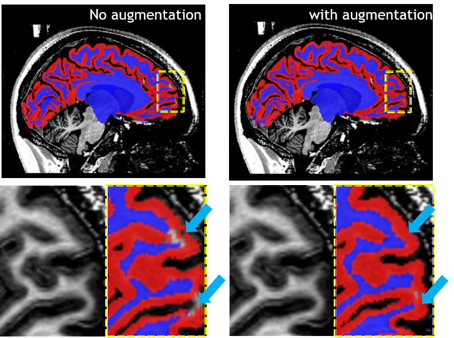
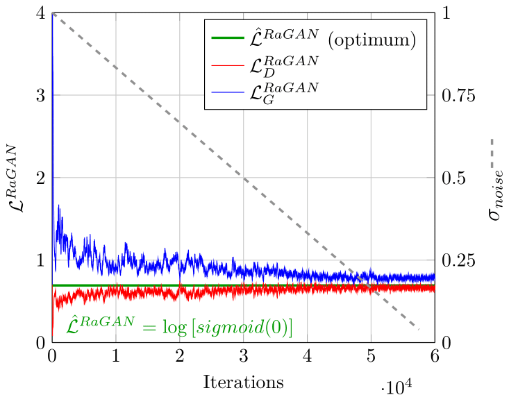
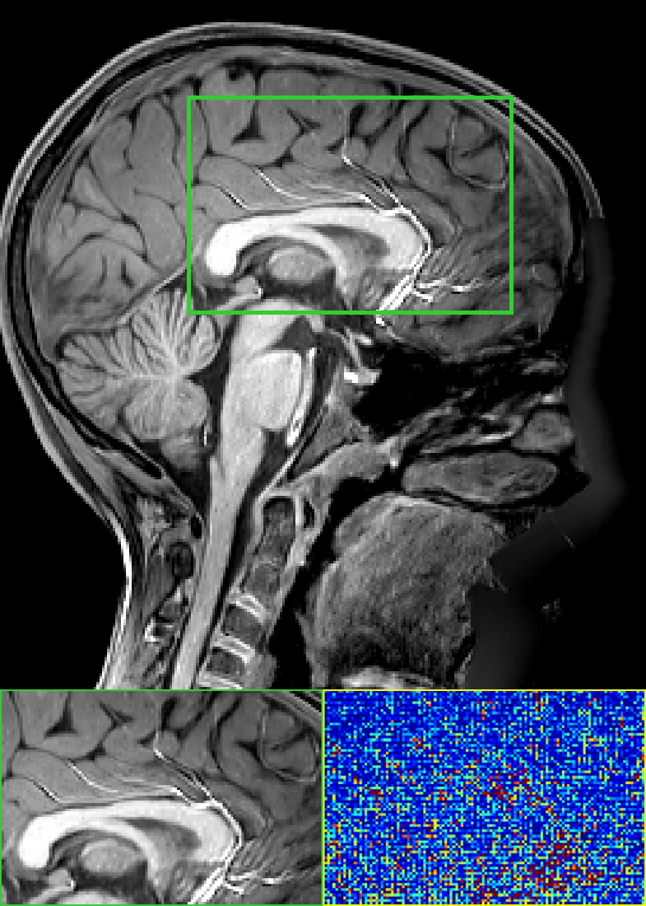
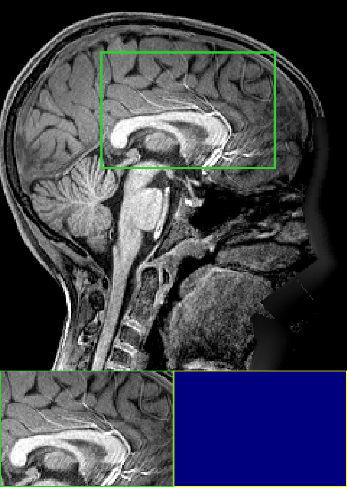

# Super resolution using GAN
_This project is mainly about deploying GAN for generating high fidelity super-resolution (SR) MRI images_

>The result of SR could be extend for consequent applications, e.g. data augmentation for segmentation models, and these result were shown in [OHBM2022](https://pure.mpg.de/rest/items/item_3505648_2/component/file_3505649/content) and [MIDL2022](https://openreview.net/pdf?id=EFiFV2MSNEB); while the development of our SR model with 3 players as well as the denoising features can be found at [MICCAI2023](https://link.springer.com/chapter/10.1007/978-3-031-44858-4_3) and [ICCV2023](https://openaccess.thecvf.com/content/ICCV2023W/CVAMD/papers/Wang_DISGAN_Wavelet-Informed_Discriminator_Guides_GAN_to_MRI_Super-Resolution_with_Noise_ICCVW_2023_paper.pdf).

* [Improving segmentation accuracy for brain MRI by training on SR augmented dataset](#Augmentation)
* [3-Player GAN for perceptually SOTA SR task](#ThreePlayerGAN)
* [Noise cleaning with wavelet-informed discriminator for SR](#DISGAN)

In my opinion, SR task should be distinguished from other generative tasks (e.g. style transfer, cross-modality generation etc.), because of the nature of the task in pursuit of sharp and realistic image content. Thus, I personally prefer to redeem a SR task as restoring HR image from an LR counterpart with minimum perceptual loss (i.e. consistent quality). As an analogy, the SR process can be seen as fitting learnable upsampling kernels within the scope of the dataset. While many models failed at this point, DDPM treats SR as a way of matching the probability distribution of HR and SR images, which overlooks the local details that are mostly approximated via the intrinsic inductive bias of the convolutional layers.

## Augmentation
The segmentation networks were separatley trained on purely real MRI T1w images (left) and a mixture of SR images and real images (right), the latter training yields more correct segmentation as are pointed out by the blue arrows. 

 

## ThreePlayerGAN
With the discrepancy for relativistic GAN loss approaching 0, for both the generator (G) and discriminator (D), the model is considered converged and balanced, which is shown to happen in our experiment.

## DISGAN 
As can be seen in the listed results, where the DISGAN output (left) shows close approximation to the GT (right). While eliminating intrinsic artefacts, like repetitive stripes shown in the  green box  below.
<figure>

</figure>

